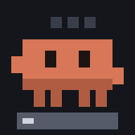
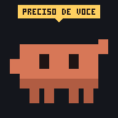
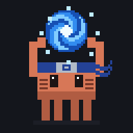
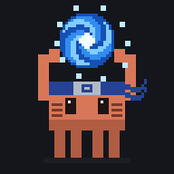
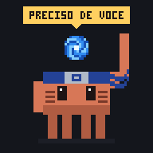
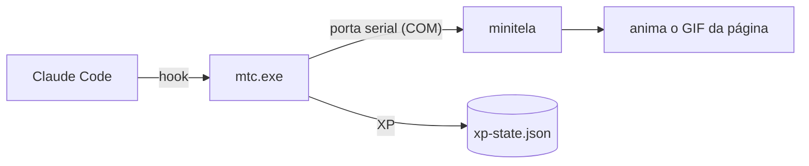

# minitela

[](LICENSE)
[](https://go.dev/dl/)
[](#requisitos)

**O Clawd em pixel art na minitela do Positivo Vision R15M, reagindo ao Claude Code em tempo real.**

A minitela é o LCD de 1,54" (240×240) que fica abaixo do teclado do notebook. Este projeto a transforma num painel de status do Claude Code. O Clawd trabalha enquanto o Claude responde, comemora quando termina e acena quando precisa de você. Cada tarefa concluída rende XP, e a cada 10 níveis uma pele nova é desbloqueada.

<table>
  <tr>
    <td align="center"><br><sub>trabalhando</sub></td>
    <td align="center"><br><sub>terminou</sub></td>
    <td align="center"><br><sub>precisa de você</sub></td>
  </tr>
  <tr>
    <td align="center"><br><sub>pele ninja (nível 10)</sub></td>
    <td align="center"><br><sub>pele ninja</sub></td>
    <td align="center"><br><sub>pele ninja</sub></td>
  </tr>
</table>

> [!NOTE]
> Projeto não oficial, sem vínculo com a Positivo Tecnologia nem com a Anthropic. Ele grava temas na memória da minitela; leia [Recuperação](#recuperação) antes de começar.

## Recursos

- **Reage ao Claude Code** pelos hooks: página "trabalhando" quando você envia um prompt, "terminou" no fim da resposta e "precisa de você" quando o Claude pede permissão ou espera sua resposta.
- **XP e níveis:** 50 níveis, streak diário e peles desbloqueáveis. O progresso aparece na tela sem interromper a animação.
- **Rápido:** um único executável Go de ~4 MB que responde em ~40 ms. As animações rodam dentro da minitela; o PC só troca de página.
- **Utilitários:** mostre o resultado de um build (`mtc run`) ou o status do git (`mtc git`) na tela.
- **Gravação segura:** o tema é validado antes de ir para a memória do aparelho, e a recuperação para o tema de fábrica é um comando só.
- **Arte gerada por código:** os GIFs são desenhados em Go puro (`pixelart\`), sem editor de imagem.

## Requisitos

- Notebook **Positivo Vision R15M** com a minitela (dispositivo USB `VID_0324&PID_0324`).
- **Windows 10 ou 11.**
- **[Go 1.27+](https://go.dev/dl/)** para compilar.
- O app oficial **[PositivoMinitela](https://apps.microsoft.com/search?query=positivo%20minitela)** (Microsoft Store). Ele traz o compilador de temas e o tema de fábrica.
- **[Claude Code](https://docs.claude.com/en/docs/claude-code/overview)** para as reações e o XP.

## Instalação

### 1. Compile

```powershell
git clone https://github.com/zdsbfkjfbc/minitela.git
cd minitela\tools\mtc
go build -trimpath -ldflags "-s -w" -o ..\..\bin\mtc.exe .
go build -trimpath -ldflags "-s -w -H=windowsgui" -o ..\..\bin\mtcw.exe .
cd ..\..
bin\mtc.exe handshake
```

O `handshake` deve responder `handshake OK`. Se falhar, feche o app oficial: a minitela aceita um programa por vez.

### 2. Copie os arquivos de fábrica

O tema de fábrica e o projeto base do tema pertencem à Positivo e não estão no repositório. Copie-os do app oficial:

```powershell
$app = (Get-AppxPackage *PositivoMinitela*).InstallLocation
$res = "$app\MiniTelaApp\assets\minipanel\resources\IDE_utils_pt"
New-Item -ItemType Directory -Force backup-tema-fabrica | Out-Null
Copy-Item "$res\Zip\file.zip", "$res\ACF\Texture.acf" backup-tema-fabrica\
```

Guarde essa pasta: o `Texture.acf` é a sua recuperação.

### 3. Gere e grave o tema do Clawd

```powershell
cd pixelart
go run .                                   # gera out\working.gif, done.gif e needs.gif
..\bin\mtc.exe theme -clawd-first          # compila o tema (não grava); mostra o caminho do .acf no fim
..\bin\mtc.exe flash <caminho do Texture.acf> 1
cd ..
```

O `-clawd-first` coloca o Clawd como página 1, a mesma que os hooks usam. A gravação leva ~25 s e reinicia a minitela.

### 4. Instale e ligue os hooks

```powershell
bin\mtc.exe install    # copia para %LOCALAPPDATA%\Programs\mtc
```

Adicione os hooks ao `~/.claude/settings.json`, trocando `SEU_USUARIO` pelo seu usuário do Windows:

<details>
<summary><code>~/.claude/settings.json</code></summary>

```json
{
  "hooks": {
    "UserPromptSubmit": [
      {
        "hooks": [
          { "type": "command", "async": true, "command": "C:/Users/SEU_USUARIO/AppData/Local/Programs/mtc/bin/mtc.exe page 1" },
          { "type": "command", "async": true, "command": "C:/Users/SEU_USUARIO/AppData/Local/Programs/mtc/bin/mtc.exe xp start" }
        ]
      }
    ],
    "Stop": [
      {
        "hooks": [
          { "type": "command", "async": true, "command": "C:/Users/SEU_USUARIO/AppData/Local/Programs/mtc/bin/mtc.exe page 6" },
          { "type": "command", "async": true, "command": "C:/Users/SEU_USUARIO/AppData/Local/Programs/mtc/bin/mtc.exe xp stop" }
        ]
      }
    ],
    "Notification": [
      {
        "hooks": [
          { "type": "command", "async": true, "command": "C:/Users/SEU_USUARIO/AppData/Local/Programs/mtc/bin/mtc.exe page 7" }
        ]
      }
    ]
  }
}
```

</details>

Pronto: envie um prompt no Claude Code e o Clawd começa a trabalhar.

### 5. (Opcional) Volte ao Clawd ao ligar e ao acordar

A minitela às vezes liga em outra página. Esta tarefa agendada, só do seu usuário, garante o Clawd ao entrar no Windows e ao acordar do sleep:

<details>
<summary>Criar a tarefa <code>MinitelaClawdDefault</code></summary>

```powershell
$acao  = New-ScheduledTaskAction -Execute "$env:LOCALAPPDATA\Programs\mtc\bin\mtcw.exe" -Argument 'startup 1'
$logon = New-ScheduledTaskTrigger -AtLogOn -User $env:USERNAME
$wake  = Get-CimClass MSFT_TaskEventTrigger root/Microsoft/Windows/TaskScheduler | New-CimInstance -ClientOnly
$wake.Enabled = $true
$wake.Subscription = "<QueryList><Query Id='0' Path='System'><Select Path='System'>*[System[Provider[@Name='Microsoft-Windows-Power-Troubleshooter'] and EventID=1]]</Select></Query></QueryList>"
$cfg = New-ScheduledTaskSettingsSet -AllowStartIfOnBatteries -DontStopIfGoingOnBatteries -StartWhenAvailable -ExecutionTimeLimit (New-TimeSpan -Minutes 3)
Register-ScheduledTask MinitelaClawdDefault -Action $acao -Trigger $logon, $wake -Settings $cfg
```

Para remover: `Unregister-ScheduledTask MinitelaClawdDefault -Confirm:$false`.

</details>

## Uso

Os exemplos supõem a pasta `%LOCALAPPDATA%\Programs\mtc\bin` no PATH; sem isso, use `bin\mtc.exe` no clone.

```powershell
mtc page 6                   # troca de página (1 a 7)
mtc text "Deploy ok"         # mostra um texto na página de Notas
mtc xp show                  # LV8  606 XP  (85% para o LV9: faltam 22 XP)  streak 1d  hoje 606 XP/66 tarefas
mtc run go build ./...       # roda o comando e mostra "OK build 12s" ou "FALHOU build (1) 8s"
mtc git                      # main | 2 alt 1 novos | +1 a frente
mtc brightness 40
```

Todos os comandos, opções e códigos de saída estão na **[referência](docs/referencia.md)**.

## Como funciona



A minitela é uma porta serial USB com um protocolo de quadros `AH…MI`. Os GIFs ficam gravados no tema, dentro do aparelho; os hooks só mandam trocar de página. Por isso a animação é fluida e o PC não gasta nada com ela. O protocolo vem do [Minitela Go](https://github.com/EduardoSpek/minitela-positivo-golang).

## Peles

Ao chegar no nível 10, a pele ninja é desbloqueada. Para usá-la:

```powershell
cd pixelart
go run . -skin ninja                                 # gera out\ninja\*.gif (-sheets também gera prévias em PNG)
..\bin\mtc.exe theme -clawd-first -gifs out\ninja
..\bin\mtc.exe flash <caminho do Texture.acf> 1
```

## Recuperação

| Problema | Solução |
|---|---|
| Voltar ao tema de fábrica | `bin\mtc.exe flash backup-tema-fabrica\Texture.acf 3` |
| A minitela não responde | Feche o app oficial e rode `bin\mtc.exe reset` como Administrador. |
| A tela travou depois de gravar | Corte a energia do notebook e grave o tema de fábrica. O `flash` valida o arquivo antes de gravar para evitar isso. |
| Ver por que um comando falhou | Rode com `$env:MT_ECHO=1`. |

## Desenvolvimento

```powershell
cd tools\mtc
go test ./...
go vet ./...
```

Depois de recompilar ou editar o `xp\xp-config.json`, rode `bin\mtc.exe install`: os hooks usam a cópia instalada, que não se atualiza sozinha. A organização do código está na [referência](docs/referencia.md#organização-do-código), e os resultados da última rodada de testes em [ANALISE-E-TESTES.md](ANALISE-E-TESTES.md).

Contribuições são bem-vindas: abra uma issue ou um pull request. Novas peles são um ótimo lugar para começar (veja `pixelart\ninja.go`).

## Créditos e licença

- Protocolo da minitela: [Minitela Go](https://github.com/EduardoSpek/minitela-positivo-golang), de Eduardo Spek (MIT), copiado em `tools\mtc\minitela` (veja `NOTICE.txt`).
- Skills e agentes em `.claude\`: [ECC](https://github.com/affaan-m/ECC) (MIT, `.claude\LICENSE-ECC.txt`).
- O Clawd é o mascote do Claude, da Anthropic; esta é uma homenagem de fã.

Distribuído sob a licença [MIT](LICENSE).
